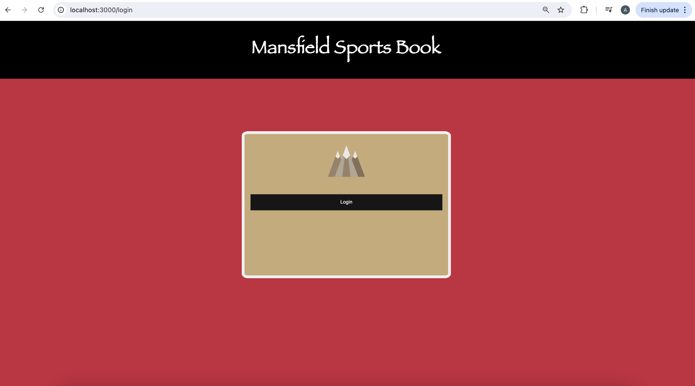
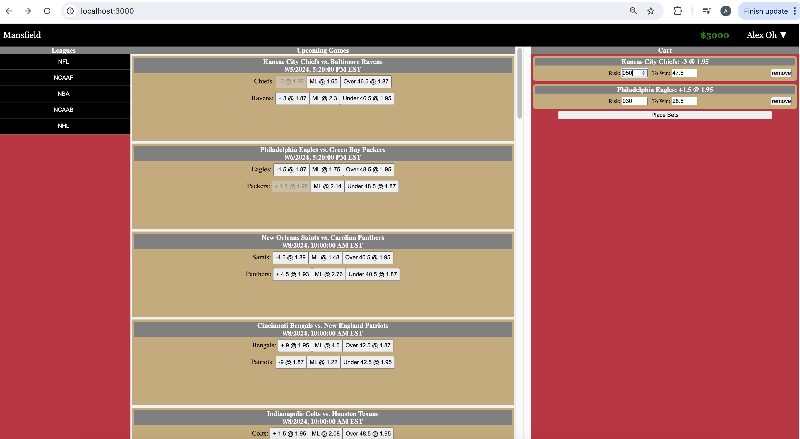
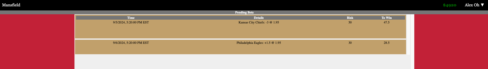
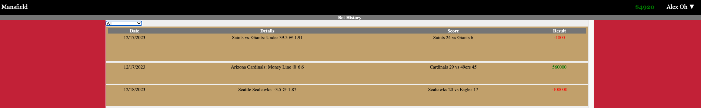

# Project Skeleton


## Application
I collaborated on the development of a sports betting web application that enables users to place and track wagers with persistent account management across sessions. I built a local endpoint API to manage user balances and betting history and contributed to frontend feature design and implementation, with a strong focus on improving the user experience through iterative feedback. I designed the Firebase database architecture and deployed Google Cloud Functions to enable real-time updates within the app. This project strengthened my skills in full-stack development, cloud deployment, and performance optimization.

This full-stack web application  allows users to place and track sports wagers with persistent, secure Google account functionality to manage balances and betting history across sessions.

## Application link

https://mansfield.csci312.dev

## Creation

This project skeleton has been setup similar to our assignments and practicals. It is a Next.JS application, created with create-next-app `💻 npx create-next-app@latest`, which uses Jest and Testing Library for testing, ESLint for static analysis, Prettier for styling, and is configured to use GitHub actions for testing pull requests.

Development dependencies installed with:

```
💻 npm install -D jest jest-environment-jsdom husky lint-staged prettier eslint-config-prettier @testing-library/react @testing-library/jest-dom
💻 npx install-peerdeps --dev eslint-config-airbnb
💻 npm install -D eslint-import-resolver-alias
```

Other dependencies installed with:

```
💻 npm install -S prop-types
```

### Additional tools you might need

#### Mocking fetch

Tools for mocking fetch can be installed with

```
💻 npm install -D fetch-mock-jest node-fetch@2.6.7
```

Note we need to pin the `node-fetch` version due to breaking changes when used with Jest in newer versions.
Note we need to pin the `node-fetch` version due to breaking changes when used with Jest in newer versions.


## Application Walkthrough

The user opens the app to the login page. Upon clicking the "Login" button, the user is taken through a secure Google Authentication process in which they use their own email to log into the application.

##### Login Page


The home page displays the sports leagues which one could bet in. The user's mock balance is displayed in the top right corner. Upon selecting a league, the closest upcoming sporting events and games in the league are displayed along with their moneyline, spread, and total over/under odds. Players can then bet their mock balance on upcoming games and receive payout in their account once the game is complete.

##### Book Page


Users can view the past filled bet history, their updated balance, and their active upcoming bets on the active and current bets pages.

##### Active Bets


##### Bet History



